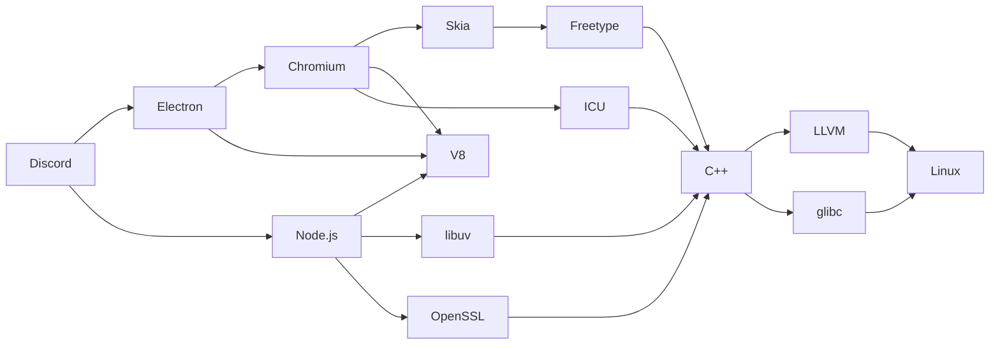

# let's talk nix

---
layout: intro-image-right
image: '/nix/images/nix.png'
transition: slide-up
---

# what is nix even
here's a helpful chart

---
layout: center
transition: slide-up
---

# How is software being provided today?

<v-clicks>

- binaries (.exe, .dmg, .apk, .deb, .rpm, etc.) are built and distributed to end users
- every system needs its own build of the software (windows, mac, linux (debian, arch, ...), etc )
- dependencies are often shared system-wide: software is often not guaranteed to run unless you install other software first

</v-clicks>


---
layout: center
transition: slide-up
---

# What if
Instead of distributing pre-built binaries, we distributed **build instructions** that anyone can use to build the software from source code in a reproducible way for their specific machine?

---
layout: center
transition: slide-up
---

# Let's take discord as an example




We need to define all of these with the build instructions, and their dependencies too!

---
layout: center
transition: slide-up
---

# Building everything from source is slow
<v-clicks>

What if we had a **shared cache** of pre-built packages based on these instructions. Instead of building everything from source every time, we could just download the packages from the cache!

</v-clicks>

---
layout: center
transition: slide-up
---

# Nix is a Language and a Package Manager that does both of these things

Aka. Nix DSL (Domain Specific Language) and nixpkgs (The Nix package registry).

<v-clicks>

It originated in 2003 as a research project by Eelco Dolstra at Utrecht University.

His 2006 doctoral thesis, **The Purely Functional Software Deployment Model**, describes a declarative and functional approach to software deployment and lays out the design of the Nix package manager.

</v-clicks>

---
layout: intro-image-right
image: '/nix/images/map_repo_size_fresh.svg'
transition: slide-up
---

# It's also the [largest and most up to date collection of packages](https://repology.org/repositories/graphs)

We currently have build instructions for over 120,000 packages, and a public, shared cache for all of them!

---
layout: center
transition: slide-up
---

# What do we use it for?

First, install nix on linux, mac, windows, and more ([download](https://nixos.org/download/))

---
layout: two-cols-header
transition: slide-up
---

# Run packages in ephemeral environments


::left::

```sh
nix-shell -p nodejs_22
```

::right::


---
layout: two-cols-header
transition: slide-up
---

# Open development environments

::left::

```nix

{
  devShells.default = pkgs.mkShell {
    buildInputs = with pkgs; [
      nodejs_22
      pnpm
    ];
    shellHook = ''
      node --version
      pnpm --version
      pnpm i
      pnpm dev
    '';
  };
}
```

::right::


---
layout: center
transition: slide-up
---

# Or: Nix + Home Manager

Use nix to configure your entire user environment declaratively.

---
layout: center
transition: slide-up
---

# Installing general applications
````md magic-move
```nix
 home-manager.users.${username} =
  {

  }
```
```nix
 home-manager.users.${username} =
  {
    # Define general applications to be installed without further configuration
    packages = with pkgs; [
      bitwarden-desktop
    ];
  }
```
```nix
 home-manager.users.${username} =
  {
    # Define general applications to be installed without further configuration
    packages = with pkgs; [
      bitwarden-desktop
      discord
      signal-desktop
      element-desktop
      tidal-hifi
    ];
  }
```
````

---
layout: center
transition: slide-up
---

# Configuring fully supported programs, e.g. firefox

````md magic-move
```nix
 home-manager.users.${username} =
  {
    programs.firefox = {
      # This is all we need to do to install firefox
      enable = true; 
    };
  }
```
```nix
 home-manager.users.${username} =
  {
    programs.firefox = {
      # This is all we need to do to install firefox
      enable = true; 

      # Install extensions
      extensions = with pkgs.nur.repos.rycee.firefox-addons; [
        ublock-origin
      ];
    };
  }
```
```nix
 home-manager.users.${username} =
  {
    programs.firefox = {
      # This is all we need to do to install firefox
      enable = true; 

      # Install extensions
      extensions = with pkgs.nur.repos.rycee.firefox-addons; [
        ublock-origin
      ];

      # Configure search
      search.default = "ddg"; # DuckDuckGo
    };
  }
```
```nix
 home-manager.users.${username} =
  {
    programs.firefox = {
      # This is all we need to do to install firefox
      enable = true; 

      # Install extensions
      extensions = with pkgs.nur.repos.rycee.firefox-addons; [
        ublock-origin
      ];

      # Configure search
      search.default = "ddg"; # DuckDuckGo

      # Deep integration with full set of internal firefox settings
      settings = { 
        "browser.startup.homepage" = "https://diluz.io/sebastian";
        "privacy.trackingprotection.enabled" = true;
      };    
    };
  }
```
````

---
layout: statement
transition: slide-up
---

## We can use this configuration on all our machines

PC, personal laptop, work laptop, servers, etc.

---
layout: statement
transition: slide-up
---

# What if we built an entire operating system around this concept?

---
layout: intro-image-right
image: '/nix/images/nixos-logo.svg'
transition: slide-up
---

# NixOS

A Linux distribution where the entire operating system is built and managed using the Nix package manager.

---
layout: center
transition: slide-up
---

# What makes NixOS special?

<v-clicks>

- Reproducibility: The entire system state can be applied to any machine, yielding the same results.
- Declarative configuration: The entire system configuration is defined using nix expressions.
- Atomic upgrades and rollbacks: System updates are atomic, meaning they either complete successfully or not at all. If an update causes issues, users can easily roll back to a previous system state.

</v-clicks>

---
layout: center
transition: slide-up
---

  # Set up foundational settings

````md magic-move
```nix
{
  # Time zone
  time.timeZone = "Europe/Berlin";

  # Localization
  i18n.defaultLocale = "en_US.UTF-8";
}
```
```nix
{
  # Time zone
  time.timeZone = "Europe/Berlin";

  # Localization
  i18n.defaultLocale = "en_US.UTF-8";
  i18n.extraLocaleSettings = {
    LC_MEASUREMENT = "de_DE.UTF-8";
    LC_MONETARY = "de_DE.UTF-8";
    LC_NUMERIC = "de_DE.UTF-8";
    LC_PAPER = "de_DE.UTF-8";
    LC_TIME = "de_DE.UTF-8";
  };
}
```
````

---
layout: center
transition: slide-up
---

  # Set up graphics card


```nix
{
  services.xserver.videoDrivers = [ "nvidia" ];
  hardware.nvidia = {
    modesetting.enable = true;
    powerManagement.enable = false;
    powerManagement.finegrained = false;
    open = false; # Don't use the open source driver
    nvidiaSettings = true;
    package = config.boot.kernelPackages.nvidiaPackages.stable;
  };
}
```

---
layout: center
transition: slide-up
---

# Configure Yubikey for login and sudo

```nix
{
  services.udev.packages = [ pkgs.yubikey-personalization ];
  services.pcscd.enable = true;
  security.pam = {
    services = {
      login.u2fAuth = true;
      sudo.u2fAuth = true;
      # for login after lockout on KDE
      kde.u2fAuth = true;
    };
    u2f.settings = {
      cue = true; # Tell users to touch the yubikey
    };
  };
}
```


---
layout: center
---


---
layout: two-cols-header
---

# Follow me for more

::left::

## <mdi-mastodon class="text-6" /> @maybeanerd@bumscode.com
## <mdi-github class="text-6" /> maybeanerd
## <mdi-web class="text-6" /> diluz.io/sebastian
## <mdi-linkedin class="text-6" /> sebastian-di-luzio

<br>

## Or come to my booth and ask me anything!
Booth = the spot where I sit down after this, I guess.

::right::

## <mdi-email class="text-6" /> give-me-feedback-on-the-nix-presentation-please@diluz.io